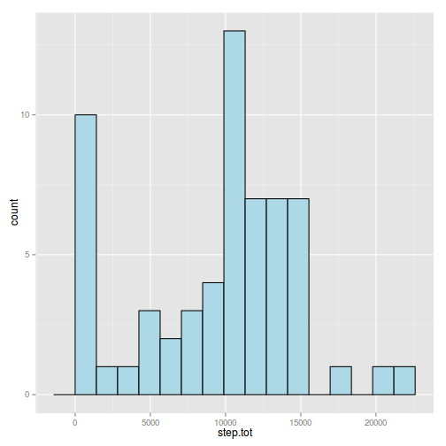
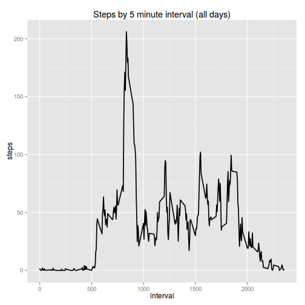
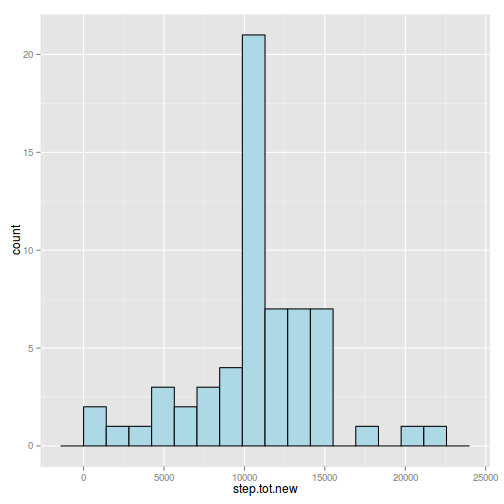
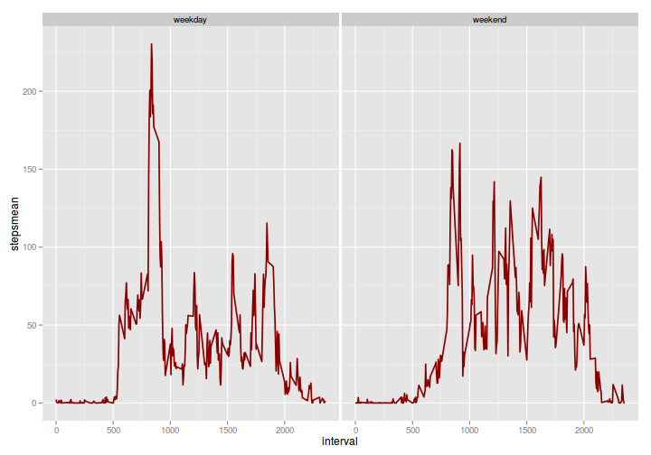

# Reproducible Research: Peer Assessment 1


## Loading and preprocessing the data

### Loading and extract data

```r
if(!file.exists(".data")) dir.create(".data")

fileUrl1 <- "https://d396qusza40orc.cloudfront.net/repdata%2Fdata%2Factivity.zip"
download.file(fileUrl1, destfile=".data/activity.zip", method = "curl")
unzip(".data/activity.zip", exdir=".data/")

activity <- read.csv(".data/activity.csv")
```
### Processing data


```r
library(lubridate)
activity$date2 <- ymd(activity$date)
```

## What is mean total number of steps taken per day?

Calculate total steps by day

```r
step.tot <- with(activity,tapply(steps, date2, sum, na.rm = TRUE))
```

#### 1 Histogram of steps total by day


```r
library(ggplot2)

# divide the range in 10 bins
binsize <- diff(range(step.tot)/15)

ggplot(NULL,aes(step.tot)) + geom_histogram(binwidth=binsize,fill="lightblue", colour = "black" )
```

 

#### 2 Mean and median of total number of steps taken per day.

```r
# combine with rbind
rbind(Mean=mean(step.tot), Median = median(step.tot))
```

```
##         [,1]
## Mean    9354
## Median 10395
```


## What is the average daily activity pattern?


#### 1 Time series plot of the 5-minute interval and the average number of steps
This time we'll use aggregate function to summary data. `agregate`returns a data.frame

```r
stepbyinterval <- aggregate(steps ~ interval, mean,data=activity)
```
Figure


```r
ggplot(stepbyinterval, aes(x=interval,y=steps)) + geom_line(size=rel(0.8)) +
    ggtitle("Steps by 5 minute interval (all days)")
```

 

#### 2 Which 5-minute interval, on average across all the days contains the maximun number of steps?


```r
stepbyinterval[which.max(stepbyinterval$steps),"interval"]
```

```
## [1] 835
```

## Imputing missing values

#### 1. Calculate and report the total number of missing values in the data set (total number of rows with NA's)


```r
# summary of data.frame
summary(activity)
```

```
##      steps               date          interval        date2           
##  Min.   :  0.0   2012-10-01:  288   Min.   :   0   Min.   :2012-10-01  
##  1st Qu.:  0.0   2012-10-02:  288   1st Qu.: 589   1st Qu.:2012-10-16  
##  Median :  0.0   2012-10-03:  288   Median :1178   Median :2012-10-31  
##  Mean   : 37.4   2012-10-04:  288   Mean   :1178   Mean   :2012-10-31  
##  3rd Qu.: 12.0   2012-10-05:  288   3rd Qu.:1766   3rd Qu.:2012-11-15  
##  Max.   :806.0   2012-10-06:  288   Max.   :2355   Max.   :2012-11-30  
##  NA's   :2304    (Other)   :15840
```
The only variable with missind data is steps. Then the total rows with NA's is 2304

#### 2. Imput missing data  using a simple strategy like mean or median for that day or for 5-minute interval.

In stepbyinterval data.frame we have the means by 5-minute interval. We use this for impute missing data in interval variable

We can use merge data.frame to get this. 


```r
unido <- merge(activity,stepbyinterval,by="interval",all.x=TRUE)
names(unido)
```

```
## [1] "interval" "steps.x"  "date"     "date2"    "steps.y"
```

```r
head(unido)
```

```
##   interval steps.x       date      date2 steps.y
## 1        0      NA 2012-10-01 2012-10-01   1.717
## 2        0       0 2012-11-23 2012-11-23   1.717
## 3        0       0 2012-10-28 2012-10-28   1.717
## 4        0       0 2012-11-06 2012-11-06   1.717
## 5        0       0 2012-11-24 2012-11-24   1.717
## 6        0       0 2012-11-15 2012-11-15   1.717
```
Where steps.x is NA we impute value from steps.y

`ifelse` function help us

```r
unido$stepscomplete <- ifelse(is.na(unido$steps.x),unido$steps.y,unido$steps.x)
```

#### 3. Create a newdataset thas is equal to the original but with the missing data filled in.

Simply we use unido data.frame with neccesary variables.


```r
activityComplete <- unido[,c(1,4,6)]
names(activityComplete)
```

```
## [1] "interval"      "date2"         "stepscomplete"
```

```r
names(activityComplete)[2:3] <- c("date","steps")
```

#### 4. Make a histogram of the total number of steps taken each day. Do these values differ from the estimates from the first part of assignment? What is the impact of imputing missing data on the estimates of the total daily number of steps?


```r
step.tot.new <- with(activityComplete,tapply(steps, date, sum, na.rm = TRUE))
```

```r
# divide the range in 10 bins
binsize <- diff(range(step.tot.new)/15)

ggplot(NULL,aes(step.tot.new)) + geom_histogram(binwidth=binsize,fill="lightblue", colour = "black" )
```

 
Mean and median 


```r
(imputedMeasures <- rbind(Mean=mean(step.tot.new), Median=median(step.tot.new)))
```

```
##         [,1]
## Mean   10766
## Median 10766
```

```r
(oldMeasures <- rbind(Mean=mean(step.tot), Median=median(step.tot)))
```

```
##         [,1]
## Mean    9354
## Median 10395
```

```r
data.frame(old=oldMeasures,imputed=imputedMeasures)
```

```
##          old imputed
## Mean    9354   10766
## Median 10395   10766
```

Mean and median increase, but median increases less than mean.


## Are there differences in activity patterns between weekdays and weekends?

#### 1. Create a new factor variable in the dataset with two levels - "weekday" and "weekend" indicating wheter a given date is a weekday or weekend day

We use `wday` from `lubridate` package

```r
activityComplete$weekday <- wday(activityComplete$date,label=TRUE)

activityComplete$weekend <- factor (ifelse(activityComplete$weekday=="Sat" | activityComplete$weekday=="Sun", "weekend","weekday") )
```

#### 2. Make a panel plot containing a time series plot of the 5-minute interval and the average number of steps taken, averaged across all weekday days or weekend days

Create a data.frame with the means over 5-minute interval. `plyr` package can be useful.


```r
library(plyr)
```

```
## 
## Attaching package: 'plyr'
## 
## The following object is masked from 'package:lubridate':
## 
##     here
```

```r
dat.final <- ddply(activityComplete, .(interval,weekend),summarize,
                   stepsmean=mean(steps))
head(dat.final)
```

```
##   interval weekend stepsmean
## 1        0 weekday   2.25115
## 2        0 weekend   0.21462
## 3        5 weekday   0.44528
## 4        5 weekend   0.04245
## 5       10 weekday   0.17317
## 6       10 weekend   0.01651
```


```r
ggplot(dat.final, aes(x=interval, y=stepsmean)) + geom_line(size=rel(0.8),col="darkred") +
    facet_wrap(~weekend)
```

 


